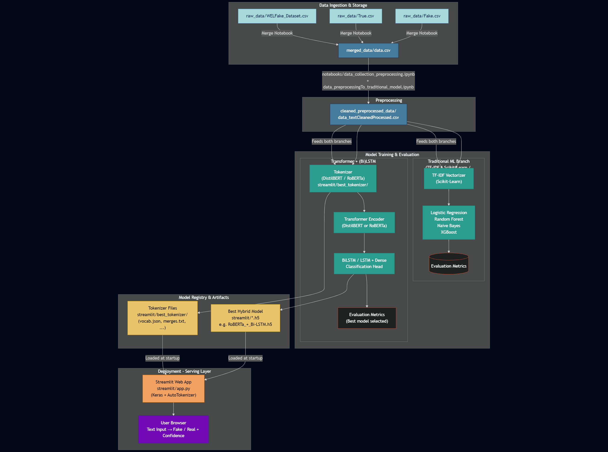

# 📰 Fake News Classifier using RoBERTa + BiLSTM, BERT & Machine Learning Models

A comprehensive fake news classifier system that combines traditional Machine Learning models with advanced Transformer-based architectures (RoBERTa + BiLSTM) to classify news articles as **Real** or **Fake** with high accuracy.

[](https://www.python.org/)
[](https://www.tensorflow.org/)
[](https://huggingface.co/)
[](LICENSE)

---

## 📋 Table of Contents

- [Problem Statement](#-problem-statement)
- [Project Overview](#-project-overview)
- [Dataset](#-dataset)
- [Directory Structure](#-directory-structure)
- [Installation](#-installation)
- [Preprocessing Pipeline](#-preprocessing-pipeline)
- [Model Architecture](#-model-architecture)
- [Technologies Used](#-technologies-used)
- [Results](#-results)
- [Deployment](#-deployment)
- [Usage](#-usage)
- [Future Enhancements](#-future-enhancements)
- [Contributors](#-contributors)

---

## 🎯 Problem Statement

Fake news spreads rapidly across digital platforms, influencing public opinion and creating widespread misinformation. This project aims to **automatically detect fake news** using Natural Language Processing (NLP) and Deep Learning techniques to ensure reliable and accurate classification of news articles.

---

## 🚀 Project Overview

This system employs a **dual-approach strategy**:

### 🔹 Traditional Machine Learning Models

- **Logistic Regression**
- **Random Forest**
- **Naive Bayes**
- **XGBoost**

These models are trained using **TF-IDF (Term Frequency-Inverse Document Frequency)** features extracted from preprocessed text.

### 🔹 Transformer + LSTM Hybrid Models

- **RoBERTa + LSTM**
- **RoBERTa + BiLSTM** ⭐ **(Best Model)**
- **DistilBERT + LSTM**
- **DistilBERT + BiLSTM**

Transformers extract high-quality contextual embeddings, while LSTM/BiLSTM layers capture sequential patterns and dependencies in text.

### 🏆 Best Model Performance

**RoBERTa + Bi-LSTM** achieved:

- **Accuracy**: 95.49%
- **ROC-AUC**: 0.9914

---

## 📊 Dataset

The project uses a merged dataset from two reliable public sources:

### 1. **WELFake Dataset**

Contains labeled fake and real news articles with comprehensive metadata.

### 2. **ISOT Dataset**

Provides two separate CSV files:

- `Fake.csv` - Fake news articles
- `True.csv` - Real news articles

### Dataset Statistics

- **Total Articles**: 62,200
- **Features**: Title + Text (combined)
- **Preprocessing**: Cleaned, deduplicated, and normalized
- **Labels**: Binary (0 = Fake, 1 = Real)

---

## 🔄 Pipeline Architecture

<div align="center">



</div>

---

## 📁 Directory Structure

```
gyaanendra-sml-project-cset211/
│
├── README.md                          # Project documentation
├── LICENSE                            # License information
├── requirements.txt                   # Python dependencies
│
├── raw_data/                          # Original datasets
│   ├── Fake.csv                       # ISOT fake news
│   ├── True.csv                       # ISOT real news
│   └── WELFake_Dataset.csv            # WELFake dataset
│
├── merged_data/                       # Combined dataset
│   └── data.csv                       # Merged raw data
│
├── cleaned_preprocessed_data/         # Preprocessed data
│   └── data_textCleanedProcessed.csv  # Cleaned & processed text
│
└── streamlit/                         # Deployment application
    ├── app.py                         # Streamlit web app
    ├── requirements.txt               # App dependencies
    ├── test.txt                       # Sample test cases
    └── best_tokenizer/                # Saved tokenizer
        ├── special_tokens_map.json
        └── tokenizer_config.json
```

---

## 🔧 Installation

### Prerequisites

- Python 3.12.11
- pip package manager

### Setup

1. **Clone the repository**

```bash
git clone https://github.com/yourusername/gyaanendra-sml-project-cset211.git
cd gyaanendra-sml-project-cset211
```

2. **Install dependencies**

```bash
pip install -r requirements.txt
```

3. **For Streamlit deployment**

```bash
cd streamlit
pip install -r requirements.txt
```

---

## 🧹 Preprocessing Pipeline

The preprocessing pipeline ensures clean, normalized text for optimal model performance:

1. **Text Lowercasing** - Convert all text to lowercase
2. **URL Removal** - Remove hyperlinks and web addresses
3. **Punctuation & Number Removal** - Clean special characters and digits
4. **Stopword Removal** - Remove common words using NLTK
5. **Lemmatization** - Reduce words to their base form
6. **Feature Combination** - Merge `title` + `text` fields
7. **Deduplication** - Remove duplicate articles

### Output Formats

- **For ML Models**: TF-IDF vectors
- **For Transformers**: Tokenized input_ids + attention_masks

---

## 🏗️ Model Architecture

### Traditional ML Pipeline

```
Cleaned Text → TF-IDF Vectorization → ML Model → Classification (Real/Fake)
```

### Transformer + BiLSTM Pipeline

```
Input Text
    ↓
Tokenizer (input_ids, attention_mask)
    ↓
RoBERTa/DistilBERT Encoder (Frozen)
    ↓
Sequence Output: (batch, 128, 768)
    ↓
┌─────────────────────────────────────┐
│         BiLSTM Layer                │
│  Forward:  Token1 → Token2 → ... →  │
│  Backward: ... ← Token2 ← Token1    │
│  Output: [forward_h + backward_h]   │
│          → (batch, 256)             │
└─────────────────────────────────────┘
    ↓
Dropout(0.3)
    ↓
Dense(64, ReLU)
    ↓
Dense(1, Sigmoid) → Probability [0,1]
```

### Key Architecture Features

- **Contextual Embeddings**: Transformers capture semantic meaning
- **Sequential Learning**: BiLSTM processes text bidirectionally
- **Regularization**: Dropout prevents overfitting
- **Binary Classification**: Sigmoid activation for probability output

---

## 🛠️ Technologies Used

| Category             | Technologies                                   |
| -------------------- | ---------------------------------------------- |
| **Programming**      | Python 3.12.11                                 |
| **Data Processing**  | Pandas, NumPy                                  |
| **NLP**              | NLTK (Stopwords, Lemmatization)                |
| **Machine Learning** | Scikit-Learn, XGBoost                          |
| **Deep Learning**    | TensorFlow, Keras                              |
| **Transformers**     | HuggingFace Transformers (RoBERTa, DistilBERT) |
| **Visualization**    | Matplotlib, Seaborn                            |
| **Deployment**       | Streamlit                                      |

---

## 📈 Results

### Model Comparison

| Model                | Accuracy   | ROC-AUC    | Notes               |
| -------------------- | ---------- | ---------- | ------------------- |
| Naive Bayes          | 84.10%     | -          | Baseline            |
| Random Forest        | 93.82%     | -          | Good generalization |
| Logistic Regression  | 94.46%     | -          | Strong baseline     |
| XGBoost              | 96.05%     | -          | Best traditional ML |
| RoBERTa + LSTM       | 94.80%     | 0.9875     | Unidirectional      |
| **RoBERTa + BiLSTM** | **95.49%** | **0.9914** | **Best Overall** ⭐ |
| DistilBERT + BiLSTM  | 94.92%     | 0.9881     | Faster inference    |

### Key Insights

- **Hybrid models** outperform traditional ML approaches
- **BiLSTM** captures bidirectional context better than LSTM
- **RoBERTa embeddings** provide superior semantic understanding
- **XGBoost** is the best traditional ML model

---

## 🚀 Deployment

### Files Included

- **Saved Model**: `best_model.h5` (RoBERTa + BiLSTM)
- **Tokenizer**: Saved in `best_tokenizer/` directory
- **Streamlit App**: Interactive web interface

### Run the Streamlit App

```bash
cd streamlit
streamlit run app.py
```

### Prediction Function Example

```python
from transformers import RobertaTokenizer
from tensorflow.keras.models import load_model

# Load model and tokenizer
model = load_model('best_model.h5')
tokenizer = RobertaTokenizer.from_pretrained('./best_tokenizer')

def predict(text):
    # Tokenize input
    inputs = tokenizer(text, max_length=128, padding='max_length',
                      truncation=True, return_tensors='tf')

    # Get prediction
    prediction = model.predict([inputs['input_ids'], inputs['attention_mask']])

    return "REAL" if prediction[0][0] > 0.5 else "FAKE"

# Test
result = predict("Breaking news: Scientists discover new planet!")
print(f"Prediction: {result}")
```

## 🔮 Future Enhancements

- [ ] **Multilingual Support** - Detect fake news in multiple languages
- [ ] **Real-time Monitoring** - Integration with social media APIs
- [ ] **Explainable AI** - LIME/SHAP for model interpretability
- [ ] **Browser Extension** - Chrome extension for instant verification
- [ ] **Domain-specific Fine-tuning** - Specialized models for health, politics, finance
- [ ] **Fact-checking Integration** - Link with fact-checking databases
- [ ] **Mobile Application** - Android/iOS app deployment

---

## 👥 Contributors

- **Gyanendra Prakash**
  - **GitHub**: [@Gyaanendra](https://github.com/Gyaanendra)
- **Goutam Mittal**
  - **GitHub**: [@goutam922](https://github.com/goutam922)
- **Dhruv Gupta**
  - **GitHub**: [@dhruvv1402](https://github.com/dhruvv1402)

---

## 📄 License

This project is licensed under the MIT License - see the [LICENSE](LICENSE) file for details.

---

## 🙏 Acknowledgments

- **WELFake Dataset** creators for providing quality data
- **ISOT Research Lab** for the fake news dataset
- **HuggingFace** for Transformer models
- **TensorFlow Team** for deep learning framework

---

## 📧 Contact

For questions or collaborations:

- **Email**: gyaanendrap@gmail.com
- **GitHub**: [@Gyaanendra](https://github.com/Gyaanendra)

---

<div align="center">

### ⭐ If you find this project useful, please consider giving it a star!

**Made with ❤️ for fighting misinformation**

</div>
